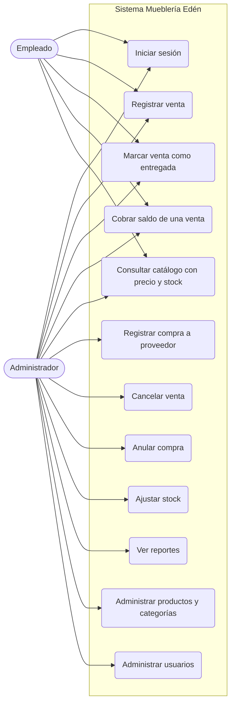

# Análisis de requisitos obtenido del sistema

Mueblería Edén. Este documento se armó leyendo **solo el código**: el backend (`backend/`), la web (`frontend/`) y la app móvil (`app/`). El E3 y la plantilla se usaron únicamente para copiar el formato y para comparar. Cuando un requisito del sistema coincide con uno del E3 se indica ("coincide con RF-XX del E3").

Convenciones: las rutas de archivo son relativas a la raíz del repositorio. `B:` es la carpeta `backend/src/main/java/com/mitienda/ecommerce/`. `W:` es `frontend/src/`. `M:` es `app/lib/`. `T:` es `backend/src/test/java/com/mitienda/ecommerce/`.

---

## 2.3.1 Actores y perfiles de usuario

El sistema solo tiene dos roles, `ADMIN` y `EMPLEADO` (tabla `roles`, entidad `B:models/Role.java`). No hay rol de cliente: quien compra se guarda en la tabla `clientes`, que no tiene usuario ni contraseña. Los permisos salen de `B:config/SecurityConfig.java` y de las anotaciones `@PreAuthorize` de cada controlador.

| ID | Actor | Descripción | Qué puede hacer | Qué no puede hacer |
|---|---|---|---|---|
| A-01 | Administrador (`ADMIN`) | Dueño del negocio. Tiene acceso a todos los módulos de la web y a la app móvil. | Todo lo del empleado, y además: crear, editar y dar de baja productos y categorías; administrar proveedores; registrar y anular compras; ajustar stock y atender alertas; cancelar ventas; corregir la entrega y editar sus datos; ver reportes, el costo de los productos y el valor del inventario; administrar usuarios. | Nada dentro del alcance. Una sola regla lo limita: no puede desactivar al último administrador activo (`ULTIMO_ADMINISTRADOR`, `B:services/UsuarioService.java:91`). |
| A-02 | Empleado (`EMPLEADO`) | Persona que atiende ventas. | Iniciar sesión; registrar ventas; registrar pagos y cobrar saldos; marcar ventas como entregadas; adjuntar la foto del comprobante; consultar productos, inventario y catálogo; ver el resumen (dashboard); crear, consultar y editar clientes. | No puede crear ni editar productos, categorías, proveedores, compras ni usuarios; no puede ver reportes; no puede ajustar stock ni atender alertas; no puede cancelar ventas ni corregir la entrega. No ve el precio de compra de los productos (`ProductoService.ocultarCostoSiNoEsAdmin`, `InventarioService.ocultarCostoSiNoEsAdmin`) ni el valor total del inventario en el dashboard (`DashboardService.java:148`). |

Observación (hallazgo): hay dos reglas que se contradicen en el código y gana la más estricta, porque la regla por ruta se evalúa antes que la anotación.
- `PATCH /api/v1/productos/{id}/stock-minimo` permite `ADMIN` y `EMPLEADO` en `ProductoController.java:90`, pero `SecurityConfig.java:114` exige `ADMIN` para todo lo que no sea `GET` en `/productos/**`. En la práctica solo lo puede usar el administrador.
- `PATCH /api/v1/inventario/alertas/{id}/atender` y `PATCH .../reactivar-alerta` están abiertos a ambos roles en el controlador (`InventarioController.java:25`), pero `SecurityConfig.java:121` exige `ADMIN` para todo lo que no sea `GET` en `/inventario/**`. También quedan solo para el administrador.

---

## 2.3.2 Requisitos funcionales

Cada requisito está en la tabla y, debajo, tiene su ficha técnica (dónde está en el código, roles, validaciones y errores, estado real y pruebas).

| ID | Requisito funcional | Criterios de aceptación | MoSCoW |
|---|---|---|---|
| RF-01 | Como usuario del sistema, quiero iniciar sesión con mi usuario y contraseña, para entrar con los permisos de mi rol. *(coincide con RF-01 del E3)* | **CA-01.1** Dado un usuario activo, cuando escribe su usuario y contraseña correctos, entonces el sistema devuelve un token y los datos del usuario con su rol. **CA-01.2** Dado un usuario que escribe una contraseña incorrecta (o que está dado de baja), cuando intenta entrar, entonces el sistema responde 401 con el código `CREDENCIALES_INVALIDAS` y deja el intento en la auditoría. | Must |
| RF-02 | Como administrador, quiero registrar y editar productos y sus categorías, para tener un catálogo sobre el cual vender. *(coincide con RF-02 del E3, con diferencias; ver sección A)* | **CA-02.1** Dado un administrador, cuando guarda un producto con SKU, nombre, categoría activa, tipo y precio de venta válidos, entonces el sistema lo guarda, crea su inventario en cero y lo muestra en el catálogo. **CA-02.2** Dado un SKU que ya existe, cuando el administrador intenta guardar, entonces el sistema responde 409 `SKU_DUPLICADO` y no guarda. **CA-02.3** Dado un precio de venta menor o igual a cero o un nombre vacío, cuando intenta guardar, entonces el sistema responde 400 `VALIDACION` con el campo que está mal. | Must |
| RF-03 | Como administrador, quiero administrar proveedores y registrar las compras que hago, para que el stock suba solo y el costo del producto quede actualizado. *(coincide con RF-03 del E3, con diferencias)* | **CA-03.1** Dado un administrador y una lista de productos con cantidad y costo unitario, cuando registra la compra, entonces el sistema la guarda como confirmada, suma las cantidades al stock, deja un movimiento de entrada por producto y actualiza el precio de compra. **CA-03.2** Dada una compra sin productos, cuando intenta guardarla, entonces el sistema responde 400 `VALIDACION` ("Debe incluir al menos un producto"). **CA-03.3** Dado un número de factura repetido para el mismo proveedor, cuando intenta guardar, entonces el sistema responde 409 `FACTURA_DUPLICADA`. | Must |
| RF-04 | Como usuario del sistema, quiero registrar una venta con sus productos, su cliente, el medio de pago y la forma de entrega, para dejar constancia de la operación y descontar del stock lo vendido. *(coincide con RF-04 del E3)* | **CA-04.1** Dado un producto activo con stock, cuando el usuario registra la venta con cliente, productos, cantidades y medio de pago, entonces el sistema guarda la venta, calcula el total, descuenta el stock y deja un movimiento de salida. **CA-04.2** Dado un precio acordado mayor al de catálogo, cuando intenta guardar, entonces el sistema responde 422 `PRECIO_EXCEDE_CATALOGO` e indica el máximo. **CA-04.3** Dada una cantidad mayor al stock, cuando intenta guardar, entonces el sistema responde 422 `STOCK_INSUFICIENTE`. **CA-04.4** Dado un precio acordado menor al costo, cuando guarda, entonces el sistema guarda la venta igual (no hay regla que lo impida). | Must |
| RF-05 | Como usuario del sistema, quiero registrar una venta cobrada solo en parte y cobrar el saldo después, para saber cuánto me debe cada cliente. *(coincide con RF-05 del E3 y con CA-07.2 del E3)* | **CA-05.1** Dado un monto pagado menor al total, cuando el usuario registra la venta, entonces el sistema la guarda como `PENDIENTE_PAGO` con el saldo igual a la diferencia. **CA-05.2** Dado un monto pagado mayor al total, cuando intenta registrarla, entonces el sistema responde 422 `PAGO_EXCEDE_TOTAL`. **CA-05.3** Dado un pago posterior que cubre el saldo, cuando el usuario lo registra, entonces el saldo queda en cero y la venta pasa a `COMPLETADA`. **CA-05.4** Dado un pago mayor al saldo, cuando intenta registrarlo, entonces el sistema responde 422 `PAGO_EXCEDE_SALDO`. | Should |
| RF-06 | Como usuario del sistema, quiero registrar cómo se entrega cada venta y marcarla como entregada, incluso si todavía tiene saldo, para saber qué ventas faltan despachar. *(coincide con RF-06 y RF-07 del E3)* | **CA-06.1** Dada una venta a domicilio o por transportadora en estado pendiente, cuando el usuario la marca como entregada, entonces el sistema cambia el estado a `ENTREGADO`, no toca el saldo y deja el hecho en la auditoría. **CA-06.2** Dada una venta por transportadora sin ciudad, cuando intenta registrarla, entonces el sistema responde 400 `CIUDAD_REQUERIDA`. **CA-06.3** Dada una venta ya entregada o cancelada, cuando intenta marcarla como entregada, entonces el sistema responde 409 (`VENTA_YA_ENTREGADA` o `VENTA_CANCELADA`). | Must |
| RF-07 | Como administrador, quiero cancelar una venta, para anular una operación hecha por error y recuperar el stock. *(no está en el E3)* | **CA-07.1** Dada una venta no cancelada, cuando el administrador la cancela, entonces el sistema devuelve el stock de cada producto, pone el saldo en cero y la marca `CANCELADA`. **CA-07.2** Dada una venta ya cancelada, cuando intenta cancelarla otra vez, entonces el sistema responde 409 `VENTA_YA_CANCELADA`. | Should |
| RF-08 | Como usuario del sistema, quiero adjuntar la foto del comprobante de un pago por QR o transferencia, para guardar el respaldo. *(coincide con RF-09 del E3)* | **CA-08.1** Dado un pago por QR o transferencia, cuando el usuario sube una foto JPG, PNG o WebP de hasta 10 MB, entonces el sistema la guarda junto al pago y deja de marcarlo como sin respaldo. **CA-08.2** Dado un pago por QR o transferencia sin foto, cuando se guarda la venta, entonces el sistema la registra igual y el pago queda marcado como `sinRespaldo`. **CA-08.3** Dado un archivo que no es una imagen válida o que pesa más de 10 MB, cuando lo sube, entonces el sistema responde 400 (`IMAGEN_INVALIDA` o `ARCHIVO_MUY_GRANDE`). | Should |
| RF-09 | Como usuario del sistema, quiero consultar los productos activos con su precio y su stock, para responderle al cliente. *(coincide con RF-08 del E3)* | **CA-09.1** Dado un usuario con sesión, cuando abre el catálogo, entonces el sistema le muestra los productos activos con nombre, precio y stock. **CA-09.2** Dado un usuario sin conexión en la app, cuando abre el catálogo, entonces la app muestra un aviso de error con el botón "Reintentar" y no cierra la sesión. | Should |
| RF-10 | Como usuario del sistema, quiero ver qué productos están por debajo del stock mínimo y qué alertas hay, para reponerlos a tiempo. *(coincide con RF-11 del E3)* | **CA-10.1** Dado un producto con stock por debajo de su mínimo, cuando el usuario abre Inventario (web) o la campana de la pantalla de inicio (app), entonces el sistema se lo muestra con su stock y su mínimo. **CA-10.2** Dado un administrador y una alerta pendiente, cuando la marca como atendida, entonces la alerta deja de aparecer. **CA-10.3** Dada una alerta que ya no está pendiente, cuando se intenta atender otra vez, entonces el sistema responde 409 `ALERTA_YA_ATENDIDA`. | Should |
| RF-11 | Como administrador, quiero ajustar el stock de un producto con un motivo, para corregir diferencias con el conteo físico. *(coincide con RF-13 del E3)* | **CA-11.1** Dado un ajuste de entrada o de salida con cantidad y motivo, cuando el administrador lo guarda, entonces el sistema actualiza el stock y deja un movimiento con el usuario y el motivo. **CA-11.2** Dado un ajuste sin motivo, cuando intenta guardarlo, entonces el sistema responde 400 `VALIDACION`. **CA-11.3** Dada una salida mayor al stock, cuando intenta guardarla, entonces el sistema responde 422 `STOCK_INSUFICIENTE`. | Should |
| RF-12 | Como usuario del sistema, quiero ver un resumen con las ventas del día y del mes y las entregas pendientes, para saber cómo está el negocio. *(coincide con RF-10 del E3; el sistema lo abre también al empleado)* | **CA-12.1** Dado un usuario con sesión, cuando abre la pantalla de inicio, entonces el sistema le muestra la cantidad y el monto de ventas de hoy y del mes, los productos más vendidos, las ventas de la semana y la cantidad de ventas por entregar. **CA-12.2** Dado un período sin ventas, cuando abre el resumen, entonces los valores de ventas aparecen en cero. | Should |
| RF-13 | Como administrador, quiero consultar ventas y ganancia de un período entre dos fechas, para saber cuánto vendí y cuánto gané. *(coincide con RF-14 del E3, con una diferencia; ver sección A)* | **CA-13.1** Dado un administrador, cuando elige fecha de inicio y de fin, entonces el sistema le muestra el total vendido, la cantidad de ventas y la ganancia (precio de venta menos el costo guardado en cada línea vendida). **CA-13.2** Dado un empleado, cuando intenta consultar un reporte, entonces el sistema responde 403 `SIN_PERMISO`. | Must |
| RF-14 | Como usuario del sistema, quiero consultar y editar los datos de los clientes y ver su historial de compras, para tener a mano cómo contactarlos. *(coincide con RF-15 del E3)* | **CA-14.1** Dado un usuario con sesión, cuando abre el historial de un cliente, entonces el sistema le muestra sus compras. **CA-14.2** Dado un NIT/CI que ya pertenece a otro cliente, cuando intenta guardar, entonces el sistema responde 409 `NIT_CI_DUPLICADO`. | Should |
| RF-15 | Como administrador, quiero dar de alta y de baja usuarios con su rol, para habilitar el acceso al personal. *(coincide con RF-12 del E3)* | **CA-15.1** Dado un administrador, cuando crea un usuario con un nombre de usuario libre, contraseña de al menos 6 caracteres y un rol válido, entonces el sistema lo guarda y le permite entrar con los permisos de ese rol. **CA-15.2** Dado un nombre de usuario ya registrado, cuando intenta crearlo, entonces el sistema responde 409 `USUARIO_DUPLICADO`. **CA-15.3** Dado el último administrador activo, cuando se intenta desactivarlo, entonces el sistema responde 422 `ULTIMO_ADMINISTRADOR`. | Could |

Tabla 7. Requisitos funcionales, criterios de aceptación y prioridad. Fuente: lectura del código del sistema.

**Total de requisitos: 15 · Must have: 6 (RF-01, RF-02, RF-03, RF-04, RF-06, RF-13) · Porcentaje Must have: 40,0 % (debe ser ≤ 60 %)**. Should: 8. Could: 1.

### Fichas técnicas de cada requisito

Para todos los endpoints, los errores comunes del formato único (`B:exception/RespuestaError.java`, `B:config/GlobalExceptionHandler.java`) son: 400 `VALIDACION` (con la lista de campos), 401 `NO_AUTENTICADO` (sin sesión o token vencido), 403 `SIN_PERMISO` (rol insuficiente), 404 `RUTA_NO_ENCONTRADA` (ruta sin `/api/v1`), 500 `ERROR_INTERNO`. Abajo solo se listan los errores propios de cada requisito.

#### RF-01 Iniciar sesión
1. **Dónde está.**
   - Endpoint: `POST /api/v1/auth/login`.
   - Controlador: `B:controllers/AuthController.java:45`. Servicio: `B:services/AuthService.java` (`login`). Filtro del token: `B:security/JwtAuthFilter.java`.
   - Web: `W:app/login/page.tsx` (guarda el token en cookie), `W:lib/api.ts:61` (`login`).
   - App: `M:screens/login/login_screen.dart`, `M:data/auth_repository.dart:21`. Además la app tiene bloqueo biométrico: `M:screens/bloqueo/bloqueo_biometrico.dart`, `M:data/biometria_service.dart`.
2. **Roles.** Público (`SecurityConfig.java:81`). Devuelve el rol (`ADMIN` o `EMPLEADO`).
3. **Validaciones y errores.** Usuario y contraseña obligatorios (`B:dto/LoginRequest.java:16,19`) → 400 `VALIDACION`. Usuario inexistente, contraseña mala o usuario inactivo → 401 `CREDENCIALES_INVALIDAS` (`AuthController.java:51`). El usuario se normaliza a minúsculas (`AuthService.java`). Los intentos fallidos y los rechazados quedan en la auditoría (`LOGIN_FALLIDO`, `LOGIN_RECHAZADO`).
4. **Estado.** Completo (backend, web y app).
5. **Pruebas.** No hay una prueba del login en sí. Solo está la del 401 sin sesión: `T:config/FormatoErrorApiTest.java` (`sinSesion_es401_conElFormatoUnico`).

#### RF-02 Productos y categorías
1. **Dónde está.**
   - Productos: `GET/POST /api/v1/productos`, `GET /productos/activos`, `/productos/{id}`, `/productos/sku/{sku}`, `/productos/categoria/{id}`, `/productos/buscar`, `PUT/DELETE /productos/{id}`, `PATCH /productos/{id}/toggle-status`, `PATCH /productos/{id}/stock-minimo`. Controlador `B:controllers/ProductoController.java`; servicio `B:services/ProductoService.java` (`createProducto` en la línea 143).
   - Categorías: `GET/POST /api/v1/categorias`, `/categorias/activas`, `PUT/DELETE /categorias/{id}`, `PATCH /categorias/{id}/toggle-status`. Controlador `B:controllers/CategoriaController.java`; servicio `B:services/CategoriaService.java`.
   - Fotos: `B:controllers/ImagenProductoController.java`, `B:services/ImagenProductoService.java`.
   - Web: `W:app/dashboard/productos/page.tsx`, `W:components/ProductoModal.tsx`, `ProductoDetalleModal.tsx`, `DetalleProductoModal.tsx`; `W:app/dashboard/categorias/page.tsx`, `W:components/CategoriaModal.tsx`.
   - App: no hay pantalla para crear ni editar. Solo consulta (ver RF-09).
2. **Roles.** Lectura: `ADMIN` y `EMPLEADO` (`SecurityConfig.java:113`). Escritura de productos y categorías: solo `ADMIN` (`SecurityConfig.java:114`; `CategoriaController.java:73-118`).
3. **Validaciones y errores.** Campos de `B:dto/ProductoRequest.java`: SKU obligatorio (máx. 50), nombre de 2 a 200, categoría obligatoria, tipo obligatorio, precio de venta obligatorio y mayor a 0, precio de compra opcional pero mayor a 0 si viene, stock mínimo no negativo, stock inicial no negativo. Errores: 409 `SKU_DUPLICADO` (`ProductoService.java:146`), 404 `CATEGORIA_NO_ENCONTRADA`, 422 `CATEGORIA_INACTIVA`, 400 `STOCK_MINIMO_INVALIDO`, 404 `PRODUCTO_NO_ENCONTRADO`. Categorías: 409 `CATEGORIA_DUPLICADA`, 409 `CATEGORIA_CON_PRODUCTOS` (al borrar una que tiene productos). Una vez que el producto tuvo una compra confirmada, el precio de compra ya no se puede cambiar editando el producto (`ProductoService.java:238-247`).
4. **Estado.** Completo en el backend y en la web. La app móvil no lo ofrece.
5. **Pruebas.** `T:services/CategoriaServiceTest.java` (4 pruebas), `T:config/IdsSinHuecosTest.java` (numeración de ids), `T:services/ImagenProductoServiceTest.java` (fotos), `T:storage/ValidadorImagenTest.java`. No hay pruebas de `ProductoService` (SKU duplicado, categoría inactiva) ni de la web.

#### RF-03 Proveedores y compras
1. **Dónde está.**
   - Compras: `GET /api/v1/compras`, `GET /compras/{id}`, `POST /compras`, `PATCH /compras/{id}/cancelar`. Controlador `B:controllers/CompraController.java`; servicio `B:services/CompraService.java` (`createCompra`, `cancelarCompra`).
   - Proveedores: `GET/POST /api/v1/proveedores`, `/proveedores/activos`, `/proveedores/buscar`, `PUT /proveedores/{id}`, `PATCH /proveedores/{id}/toggle-status`. Controlador `B:controllers/ProveedorController.java`; servicio `B:services/ProveedorService.java`.
   - Web: `W:app/dashboard/compras/page.tsx`, `W:components/CompraModal.tsx`, `DetalleCompraModal.tsx`; `W:app/dashboard/proveedores/page.tsx`, `W:components/ProveedorModal.tsx`.
   - App: no existe.
2. **Roles.** Solo `ADMIN` (`CompraController.java:20`, `ProveedorController.java:20`). El menú de la web también los oculta al empleado (`W:components/Sidebar.tsx:37-38`, `adminOnly`).
3. **Validaciones y errores.** `B:dto/CompraRequest.java`: al menos un producto, cantidad mínima 1, precio unitario mayor a 0; proveedor opcional. Errores: 404 `PROVEEDOR_NO_ENCONTRADO`, 404 `PRODUCTO_NO_ENCONTRADO`, 409 `FACTURA_DUPLICADA` (`CompraService.java:114`). Anular: 409 `COMPRA_YA_ANULADA` (`:208`), 422 `COMPRA_STOCK_VENDIDO` (`:217`, cuando parte de lo comprado ya se vendió). Proveedor: nombre, NIT, contacto y teléfono obligatorios; 409 `NIT_DUPLICADO`. Una compra nace confirmada (`CompraService.java:126`): no hay paso de confirmar ni de editar.
4. **Estado.** Completo en el backend y en la web.
5. **Pruebas.** `T:services/CompraServiceTest.java` (registrar, sin proveedor, anular, anular con stock vendido) y `T:services/ErroresNegocioTest.java` (404 y 409 de compras). Sin pruebas para `FACTURA_DUPLICADA` ni para proveedores.

#### RF-04 Registrar una venta
1. **Dónde está.**
   - Endpoint: `POST /api/v1/ventas`. También `GET /ventas`, `/ventas/{id}`, `/ventas/del-dia`, `/ventas/ultimas`, `/ventas/cliente/{id}`, `/ventas/estado/{estado}`, `/ventas/fechas`.
   - Controlador: `B:controllers/VentaController.java:75`. Servicio: `B:services/VentaService.java` (`createVentaDirecta`, línea 100). Después de guardar, el controlador genera el comprobante de venta (`B:services/ComprobanteService.java`).
   - Web: `W:app/dashboard/ventas/page.tsx`, `W:components/RegistrarVentaModal.tsx`, `W:lib/api.ts:743` (`createVentaDirecta`).
   - App: `M:screens/ventas/nueva_venta_screen.dart`, `M:data/ventas_repository.dart:83`.
2. **Roles.** `ADMIN` y `EMPLEADO` (`VentaController.java:31`). El vendedor sale del token, no de lo que manda el cliente (`UsuarioActualService`).
3. **Validaciones y errores.** `B:dto/VentaRequest.java`: método de pago y lista de productos obligatorios; cantidad mínima 1. Errores: 400 `CLIENTE_REQUERIDO` (sin cliente registrado ni nombre de mostrador, `VentaService.java:102`), 404 `CLIENTE_NO_ENCONTRADO`, 404 `PRODUCTO_NO_ENCONTRADO`, 422 `PRODUCTO_NO_DISPONIBLE` (producto dado de baja, `:169`), 422 `STOCK_INSUFICIENTE` (`:173`), 422 `PRECIO_EXCEDE_CATALOGO` (`:185`, `:242`), 400 `MONTO_INVALIDO`, 422 `PAGO_EXCEDE_TOTAL`. Si se manda un cliente nuevo de mostrador, el sistema lo crea como cliente. La venta guarda el costo unitario de cada línea en ese momento (`VentaService.java:263-269`).
4. **Estado.** Completo en backend y web. En la app queda **parcial**: la app no manda descuento por producto (no aparece `precioUnitarioConDescuento` en `M:screens/ventas/nueva_venta_screen.dart`); la web sí (`W:components/RegistrarVentaModal.tsx:398`).
5. **Pruebas.** `T:services/ErroresNegocioTest.java` (`stockInsuficiente_es422`, `precioMayorAlDeCatalogo_es422`, `productoDeBaja_es422`, `ventaSinCliente_es400`), `T:services/VentaServiceRespuestaTest.java` (4 pruebas, incluida la de venta con descuento por debajo del costo), `T:services/VentaServiceEntregaTest.java`. En la app: `app/test/entrega_venta_test.dart` (datos que viajan al registrar). Sin pruebas en la web.

#### RF-05 Pago parcial y cobro de saldo
1. **Dónde está.**
   - Al registrar: `VentaService.java:207-218` (calcula saldo y estado `PENDIENTE_PAGO` o `COMPLETADA`).
   - Cobro posterior: `POST /api/v1/pagos`. Controlador `B:controllers/PagoController.java:66`; servicio `B:services/PagoService.java` (`registrarPago`, línea 88).
   - Web: `W:components/CobrarSaldoModal.tsx` (se abre desde `W:app/dashboard/ventas/page.tsx:27`), saldo pendiente en `RegistrarVentaModal.tsx:102`.
   - App: diálogo "Registrar pago" en `M:screens/ventas/venta_detalle_screen.dart:454,633`; `M:data/ventas_repository.dart:36`.
2. **Roles.** `ADMIN` y `EMPLEADO` (`PagoController.java:25`).
3. **Validaciones y errores.** 400 `MONTO_INVALIDO` (monto pagado negativo), 422 `PAGO_EXCEDE_TOTAL` (al registrar la venta), 422 `PAGO_EXCEDE_SALDO` (`PagoService.java:97`), 409 `VENTA_CANCELADA` (pago sobre venta cancelada, `:94`), 404 `VENTA_NO_ENCONTRADA`. En `PagoRequest` el monto es obligatorio y mayor a 0.
4. **Estado.** Completo.
5. **Pruebas.** `T:services/ErroresNegocioTest.java` (`pagoMayorAlSaldo_es422`, `pagoSobreUnaVentaCancelada_es409`, `ventaInexistenteAlRegistrarUnPago_es404`). No hay prueba de `PAGO_EXCEDE_TOTAL` ni de que la venta pase a completada al cubrir el saldo.

#### RF-06 Entrega de la venta
1. **Dónde está.**
   - Endpoints: `PATCH /api/v1/ventas/{id}/entregar` (`VentaController.java:113`), `PATCH /ventas/{id}/deshacer-entrega` (`:123`), `PATCH /ventas/{id}/datos-entrega` (`:134`).
   - Servicio: `VentaService.java` (`marcarEntregado` línea 377, `deshacerEntrega` 404, `actualizarDatosEntrega` 434, estado inicial en `resolverEstadoInicial` 479).
   - Web: `W:lib/api.ts:776` (`marcarVentaEntregada`), `W:app/dashboard/ventas/page.tsx` (ícono de entregar, línea 537), `W:components/EditarEntregaModal.tsx`, `DeshacerEntregaModal.tsx`, reglas en `W:lib/entrega.ts`.
   - App: `M:screens/ventas/venta_detalle_screen.dart:129-132` y `:456-460`, `M:data/ventas_repository.dart:51`, reglas en `M:screens/ventas/estado_entrega_ui.dart`.
2. **Roles.** Marcar entregada: `ADMIN` y `EMPLEADO`. Deshacer la entrega y editar los datos de entrega: solo `ADMIN` (`VentaController.java:124,135`).
3. **Validaciones y errores.** 400 `CIUDAD_REQUERIDA` (transportadora sin ciudad, `VentaService.java:119`); 409 `VENTA_CANCELADA`; 409 `VENTA_YA_ENTREGADA`; 409 `VENTA_ENTREGA_PENDIENTE` (al deshacer algo que no está entregado); 422 `VENTA_EN_TIENDA_SIN_ENTREGA` (retiro en tienda no tiene entrega que corregir). El retiro en tienda siempre nace `ENTREGADO`. Domicilio y transportadora nacen `PENDIENTE` (o `ENTREGADO` si se pide).
4. **Estado.** Completo en el backend y en la app. En la web está **parcial**: la corrección de entrega está apagada con una bandera (`W:lib/entrega.ts`, `CORREGIR_ENTREGA_ACTIVO = false`).
5. **Pruebas.** `T:services/VentaServiceEntregaTest.java` (16 pruebas) y `app/test/entrega_venta_test.dart` (16 pruebas).

#### RF-07 Cancelar una venta
1. **Dónde está.** `PATCH /api/v1/ventas/{id}/cancelar`: `VentaController.java:102`; `VentaService.java:323` (`cancelarVenta`). Web: `W:lib/api.ts:763` (`cancelarVenta`) usada desde `W:app/dashboard/ventas/page.tsx`. App: no existe.
2. **Roles.** Solo `ADMIN` (`VentaController.java:103`).
3. **Validaciones y errores.** 404 `VENTA_NO_ENCONTRADA`, 409 `VENTA_YA_CANCELADA` (`VentaService.java:328`). Deja un movimiento de entrada por producto y una anotación en la auditoría.
4. **Estado.** Completo en backend y web.
5. **Pruebas.** `T:services/ErroresNegocioTest.java` (`cancelarUnaVentaYaCancelada_es409`, `ventaInexistente_es404...`). No encontré una prueba que compruebe que se devuelve el stock.

#### RF-08 Foto del comprobante de pago
1. **Dónde está.**
   - Endpoint: `POST /api/v1/pagos/{id}/comprobante` (`PagoController.java:76`); servicio `PagoService.adjuntarComprobante`; validación de la imagen `B:storage/ValidadorImagen.java`; almacén `B:storage/AlmacenSupabase.java` / `AlmacenLocal.java`.
   - Web: `W:components/RegistrarVentaModal.tsx:445-450` (sube la foto al primer pago de la venta), `W:components/PagoDetalleModal.tsx`.
   - App: `M:screens/ventas/nueva_venta_screen.dart:190,280`, `M:data/ventas_repository.dart:91`.
   - Marca de respaldo: `B:dto/PagoDTO.java:42,57` (`sinRespaldo`).
2. **Roles.** `ADMIN` y `EMPLEADO`.
3. **Validaciones y errores.** 400 `ARCHIVO_VACIO`, 400 `ARCHIVO_MUY_GRANDE` (máximo 10 MB, `ValidadorImagen.java:24`), 400 `IMAGEN_INVALIDA` (no es JPG/PNG/WebP, o la extensión no coincide con el contenido), 404 `PAGO_NO_ENCONTRADO`. La foto nunca bloquea la venta: si falla la subida, la venta queda registrada y la web y la app lo avisan.
4. **Estado.** Completo.
5. **Pruebas.** `T:services/PagoServiceComprobanteTest.java` (5), `T:storage/ValidadorImagenTest.java`, `T:storage/AlmacenSupabaseTest.java`, `T:storage/AlmacenLocalTest.java`, `T:services/VentaServiceRespuestaTest.java` (pago por QR sin foto queda sin respaldo).

#### RF-09 Catálogo con precio y stock
1. **Dónde está.**
   - App: `GET /api/v1/inventario/catalogo` (`B:controllers/InventarioController.java:58`, `InventarioService.getCatalogoApp`). Pantalla `M:screens/catalogo/catalogo_screen.dart`, datos `M:data/catalogo_repository.dart:15`.
   - Web: precio en `W:app/dashboard/productos/page.tsx:404`, stock en la misma pantalla y en `W:app/dashboard/inventario/page.tsx`.
2. **Roles.** `ADMIN` y `EMPLEADO`. Al empleado no le llega el precio de compra.
3. **Validaciones y errores.** Solo lectura. Sin conexión, la app lanza `ApiException` de tipo `sinConexion` (`M:data/api_client.dart:94-100`, tiempo máximo de 12 segundos) y la pantalla muestra el error con "Reintentar" (`catalogo_screen.dart:97,206`). Un error de conexión no borra la sesión (la sesión solo se borra al cerrar sesión).
4. **Estado.** Completo.
5. **Pruebas.** No hay prueba del catálogo en el backend. En la app, `app/test/imagen_producto_url_test.dart` prueba solo la URL de la foto.

#### RF-10 Stock bajo y alertas
1. **Dónde está.**
   - Endpoints: `GET /api/v1/inventario/stock-bajo`, `/sin-stock`, `/alertas/pendientes`, `PATCH /inventario/alertas/{id}/atender`, `PATCH /inventario/producto/{id}/reactivar-alerta`; catálogo con `?soloBajoMinimo=true`.
   - Servicio: `B:services/InventarioService.java` (`verificarYCrearAlerta`, `marcarAlertaAtendida` línea 378).
   - Web: `W:app/dashboard/inventario/page.tsx` (alertas y "Marcar como atendida"), `W:components/NotificacionesMenu.tsx`, `ConfigurarStockMinimoModal.tsx`.
   - App: campana de stock bajo en `M:screens/home/home_screen.dart:88,2534-2579`.
2. **Roles.** Ver: `ADMIN` y `EMPLEADO`. Atender o reactivar alertas: efectivamente solo `ADMIN` (ver observación en 2.3.1).
3. **Validaciones y errores.** 404 `ALERTA_NO_ENCONTRADA`, 409 `ALERTA_YA_ATENDIDA`.
4. **Estado.** Completo en backend y web. En la app solo se consulta.
5. **Pruebas.** `T:services/AlertaAtendidaTest.java` (7 pruebas).

#### RF-11 Ajuste de stock
1. **Dónde está.** `POST /api/v1/inventario/ajustar` (`InventarioController.java:119`); `InventarioService.ajustarInventario` (línea 197). Historial: `GET /inventario/producto/{id}/historial`, `/inventario/ajustes/ultimos`. Web: `W:components/MovimientoInventarioModal.tsx`, `HistorialProductoModal.tsx`, `W:lib/api.ts:563`. App: no existe.
2. **Roles.** Solo `ADMIN` (`InventarioController.java:120`).
3. **Validaciones y errores.** Producto, cantidad, tipo y motivo obligatorios (máx. 200) → 400 `VALIDACION`. Tipo distinto de ENTRADA o SALIDA → 400 `MOVIMIENTO_INVALIDO`. Salida mayor al stock → 422 `STOCK_INSUFICIENTE` (`B:models/Inventario.java:74`). 404 `INVENTARIO_NO_ENCONTRADO`. Cada ajuste deja un movimiento con el usuario que sale del token y una anotación en la auditoría.
4. **Estado.** Completo en backend y web.
5. **Pruebas.** `T:services/ErroresNegocioTest.java` (`ajusteDeSalidaMayorAlStock_es422_conElMensaje`). No hay prueba del camino feliz del ajuste.

#### RF-12 Resumen (dashboard)
1. **Dónde está.** `GET /api/v1/dashboard/estadisticas` y `/dashboard/ventas-semanal` (`B:controllers/DashboardController.java:40,51`); `B:services/DashboardService.java`. Web: `W:app/dashboard/page.tsx:53`. App: `M:screens/home/home_screen.dart`, `M:data/dashboard_repository.dart:11,21`.
2. **Roles.** `ADMIN` y `EMPLEADO` (`DashboardController.java:19`). Al empleado el valor del inventario le llega en `null`.
3. **Validaciones y errores.** Solo lectura. La respuesta incluye ventas de hoy, del mes y del año, productos con stock bajo, alertas, clientes, productos más vendidos, ventas de los últimos días y `ventasPorEntregar` (`B:dto/DashboardResponse.java`).
4. **Estado.** Completo.
5. **Pruebas.** No encontradas.

#### RF-13 Reportes de ventas y ganancia
1. **Dónde está.** `GET /api/v1/reportes/ventas?inicio&fin`, `/financiero?inicio&fin`, `/productos-mas-vendidos`, `/clientes-frecuentes`, `/inventario-valorizado`, `/ventas-por-categoria`, `/ventas-por-producto`, `/ventas-por-metodo-pago`, `/cuentas-por-cobrar` (`B:controllers/ReporteController.java`); `B:services/ReporteService.java` (`getReporteVentas` línea 95, `getReporteFinanciero` línea 432). Web: `W:app/dashboard/reportes/page.tsx`, `W:components/ReporteParametrosModal.tsx`, `ReportePersonalizadoModal.tsx`, `ReporteVistaPrevia.tsx`, `W:lib/reporteCriterios.ts`, `W:lib/api.ts:1788-2021`. App: no existe.
2. **Roles.** Solo `ADMIN`, exigido dos veces: `SecurityConfig.java:129` y `ReporteController.java:24`.
3. **Validaciones y errores.** Las fechas son obligatorias y deben ser fecha-hora ISO; si no, 400 `PETICION_INVALIDA`. Empleado → 403 `SIN_PERMISO`. El reporte de ventas excluye las canceladas (`ReporteService.java:99`). La ganancia usa solo ventas `COMPLETADA` (`:439`) y el costo guardado en cada línea (`:443-447`).
4. **Estado.** Completo en backend y web.
5. **Pruebas.** `T:services/ReporteVentasPorProductoTest.java` (1 prueba). `T:config/FormatoErrorApiTest.java` prueba el 403 por rol, pero no sobre un reporte en concreto. No hay prueba de la ganancia.

#### RF-14 Clientes
1. **Dónde está.** `GET /api/v1/clientes`, `/clientes/con-estadisticas`, `/clientes/buscar`, `/clientes/{id}`, `/clientes/{id}/historial-compras`, `/clientes/{id}/historial-compras/filtrado`, `POST /clientes`, `PUT /clientes/{id}` (`B:controllers/ClienteController.java`); `B:services/ClienteService.java`. Web: `W:app/dashboard/clientes/page.tsx`, `W:components/ModificarClienteModal.tsx`, `HistorialComprasModal.tsx`, `DetalleVentaClienteModal.tsx`. App: solo el selector de cliente en Nueva venta (`M:data/clientes_repository.dart:11`).
2. **Roles.** `ADMIN` y `EMPLEADO`. `POST /clientes` no tiene anotación propia (`ClienteController.java:85`), pero exige sesión por `SecurityConfig.java:134`.
3. **Validaciones y errores.** Nombre (2 a 100) y teléfono (máx. 15) obligatorios, email con formato válido. 409 `NIT_CI_DUPLICADO` (`ClienteService.java:127,167`), 409 `EMAIL_DUPLICADO` (`:121`), 404 `CLIENTE_NO_ENCONTRADO`.
4. **Estado.** Completo en backend y web. En la app es parcial (solo elegir cliente).
5. **Pruebas.** Solo `ErroresNegocioTest` cubre `CLIENTE_NO_ENCONTRADO`. No hay pruebas de `NIT_CI_DUPLICADO`.

#### RF-15 Usuarios
1. **Dónde está.** `GET/POST /api/v1/usuarios`, `/usuarios/{id}`, `/usuarios/activos`, `/usuarios/rol/{role}`, `PUT/DELETE /usuarios/{id}`, `PATCH /usuarios/{id}/toggle-status` (`B:controllers/UsuarioController.java`); `B:services/UsuarioService.java`. Web: `W:app/dashboard/usuarios/page.tsx`, `W:components/UserModal.tsx`. App: no existe.
2. **Roles.** Solo `ADMIN` (`UsuarioController.java:22`; menú `adminOnly`).
3. **Validaciones y errores.** Nombre y apellido de 2 a 50, usuario de 3 a 30 solo con letras, números, punto y guion bajo, contraseña de al menos 6 (`B:dto/UsuarioRequest.java`). 409 `USUARIO_DUPLICADO` (`UsuarioService.java:126`), 400 `PASSWORD_REQUERIDA`, 400 `ROL_REQUERIDO`, 400 `ROL_INVALIDO`, 422 `ULTIMO_ADMINISTRADOR` (`:91`), 404 `USUARIO_NO_ENCONTRADO`. Las contraseñas se guardan con BCrypt (`SecurityConfig.java:172`).
4. **Estado.** Completo en backend y web.
5. **Pruebas.** No encontradas para este módulo.

---

## 2.3.3 Requisitos no funcionales

| ID | Tipo | Enunciado | Métrica de verificación |
|---|---|---|---|
| RNF-01 | Rendimiento | Las pantallas más consultadas (lista de productos, catálogo, ventas) cargan sin hacer esperar al cliente. | `GET /api/v1/productos` y `GET /api/v1/inventario/catalogo` responden en menos de 2 segundos con el catálogo completo y un solo usuario, con el servicio ya activo. Se mide con la pestaña Red del navegador, o con el registro de `MedicionRendimiento` (solo en desarrollo). |
| RNF-02 | Seguridad | Todo lo que no sea el login y la ruta de salud exige sesión; las contraseñas se guardan cifradas; los permisos dependen del rol; ninguna clave está en el repositorio. | Una petición sin token a cualquier ruta protegida responde 401 `NO_AUTENTICADO`. Un empleado que pide una ruta de administrador recibe 403 `SIN_PERMISO`. Las contraseñas en la tabla `usuarios` están en formato BCrypt. Una búsqueda de claves en el repositorio no encuentra ninguna. |
| RNF-03 | Usabilidad | Registrar una venta, que es la operación más usada, se hace en una sola pantalla y sin pasos intermedios. | Registrar una venta con un producto, su pago y su entrega se completa en 5 pasos o menos desde la pantalla de inicio de la app, y desde una sola ventana en la web. Se mide contando los toques. |
| RNF-04 | Compatibilidad | El servidor corre en Java 17, la web en navegadores actuales y la app en teléfonos Android. | `java -version` reporta 17 o superior. La app instala y abre en Android 7.0 (API 24) o superior. Para la web, se prueba en Chrome y Edge (no hay una lista de navegadores definida en el código). |
| RNF-05 | Disponibilidad | El servidor expone una ruta de salud pública, y cuando no hay conexión la app lo avisa en lugar de cerrarse. | `GET /api/v1/salud` responde 200 con `estado: OK`. Con el servidor apagado, la app muestra "Sin conexión con el servidor" y "Reintentar" en menos de 12 segundos (tiempo máximo de espera) sin cerrar la sesión. |

Tabla 8. Requisitos no funcionales. Fuente: lectura del código del sistema.

### Qué parte del sistema cumple cada RNF y cómo se mide

**RNF-01 Rendimiento**
- Qué lo cumple: la consulta del catálogo cruza precio y stock en el servidor en una sola llamada (`InventarioController.java:58`, `InventarioService.getCatalogoApp`). El pool de conexiones tiene un máximo de 10 (`backend/src/main/resources/application.properties`, `spring.datasource.hikari.maximum-pool-size`). La web y la app cargan en paralelo y tolerando fallos parciales (`W:lib/cargaParcial.ts`, `W:components/AvisoCargaParcial.tsx`).
- Cómo se mide: `B:config/MedicionRendimiento.java` anota en `target/medicion-rendimiento.log` el tiempo de cada petición, las consultas SQL y el tamaño de la respuesta, pero solo con el perfil `dev`. En producción se mide con las herramientas del navegador.
- Estado: no hay prueba automática de rendimiento. La latencia en producción depende del lugar donde estén el servidor y la base de datos, y eso no se fija en el código: no encontrado en el código.

**RNF-02 Seguridad**
- Qué lo cumple:
  - Sesión sin estado con token firmado (JWT, jjwt 0.12.3; vence a las 24 horas, `application.properties`, `jwt.expiration=86400000`; la firma sale de la variable `JWT_SECRET`): `B:config/SecurityConfig.java:136-138`, `B:security/JwtAuthFilter.java`.
  - 401 y 403 con el formato único: `SecurityConfig.java:144-151`.
  - Contraseñas con BCrypt: `SecurityConfig.java:172`.
  - Roles por ruta (`SecurityConfig.java:104-134`) y por anotación (`@PreAuthorize`).
  - El costo de los productos no llega al empleado (`ProductoService.ocultarCostoSiNoEsAdmin`).
  - Las rutas viejas sin `/api/v1` responden 404 (`B:config/RutasSinVersionFilter.java`).
  - Las claves van en variables de entorno y `.gitignore` excluye `.env`, `.env.*` (`.gitignore:92-94`) y, en la app, la llave de firma `key.properties`.
  - La app guarda el token en almacenamiento cifrado (`M:data/token_storage.dart`, `flutter_secure_storage`).
- Cómo se mide: peticiones sin token y con token de empleado a las rutas de administrador; consulta a la tabla `usuarios`; búsqueda de claves en el repositorio.
- Observación: la web guarda el token y el rol en cookies de JavaScript (`W:app/login/page.tsx:47-62`, librería `js-cookie`), no en cookies protegidas.
- Pruebas: `T:config/FormatoErrorApiTest.java` (`sinSesion_es401`, `rolSinPermisoPorRuta_es403`, `rolSinPermisoPorAnotacion_es403`).

**RNF-03 Usabilidad**
- Qué lo cumple: en la app, Nueva venta se abre como un panel desde la pantalla de inicio (`M:screens/home/home_screen.dart:174-183`, `M:screens/ventas/nueva_venta_screen.dart`) con cliente, productos, pago, comprobante y entrega en la misma pantalla. En la web es una sola ventana (`W:components/RegistrarVentaModal.tsx`).
- Cómo se mide: contar los toques de una venta de ejemplo. No hay una prueba automática; no encontrado en el código.

**RNF-04 Compatibilidad**
- Qué lo cumple: `backend/pom.xml:25` (Java 17) y `backend/Dockerfile:2,10` (imágenes con Java 17). La app toma el mínimo de Android de Flutter (`app/android/app/build.gradle.kts:35`, `minSdk = flutter.minSdkVersion`); el comentario del archivo (líneas 30-34) dice que ese mínimo es 24, es decir Android 7.0, pero el número no está escrito en el proyecto.
- Web: no hay `browserslist` ni lista de navegadores en `frontend/package.json`: la compatibilidad es la que trae Next.js por defecto. No encontrado en el código.
- Cómo se mide: instalar el APK en un teléfono con Android 7.0 y abrir la web en Chrome y Edge.

**RNF-05 Disponibilidad**
- Qué lo cumple: `GET /api/v1/salud` (`B:controllers/SaludController.java`, pública por `SecurityConfig.java:85`). En la app, `M:data/api_client.dart:94-100` convierte los fallos de red y el tiempo agotado (12 s) en `sinConexion`, y las pantallas muestran el aviso con "Reintentar" (`M:screens/catalogo/catalogo_screen.dart:97,206`). En la web, el aviso de carga parcial (`W:components/AvisoCargaParcial.tsx`) y el vigilante de sesión vencida (`W:components/SesionExpiradaWatcher.tsx`).
- Cómo se mide: llamar a `/api/v1/salud` en el horario de atención; apagar el servidor y abrir la app.
- Pruebas: `app/test/error_api_test.dart` prueba la lectura de los errores de la API; no hay prueba del caso sin conexión.

---

## 2.3.4 Requisitos declarados fuera de alcance

Esta tabla muestra lo que el sistema **no ofrece hoy** (porque su ruta está apagada o porque no hay código), con el estado en que quedó en el repositorio. Coincide con lo declarado en el E3, salvo lo indicado.

| Capacidad excluida | MoSCoW | Justificación (según lo que muestra el código) |
|---|---|---|
| Módulo independiente de envíos y transportadoras | Won't | La entrega se resuelve dentro de la venta con modalidad, destino, estado, ciudad, transportadora y guía (`B:models/Venta.java`, `VentaService.java:110-159`). Los controladores `EnvioController` y `TransportadoraController` siguen en el repositorio, pero `RutasSinVersionFilter` los deja inalcanzables (404) porque no usan `/api/v1`. En la web el menú está comentado (`W:components/Sidebar.tsx:43`) y las pantallas siguen existiendo en `W:app/dashboard/envios/`. *(coincide con el E3)* |
| Módulo de promociones con reglas de descuento | Won't | El descuento se registra por producto dentro de la venta (`VentaRequest.ItemVentaRequest.precioUnitarioConDescuento`). `PromocionController` sigue en el repositorio y está apagado por la misma razón. Menú comentado en `Sidebar.tsx:48`. *(coincide con el E3)* |
| Pantalla de configuración general | Could | `ConfiguracionController` y `W:app/dashboard/configuracion/` siguen en el repositorio; la ruta de la API está apagada y el menú comentado (`Sidebar.tsx:49`). *(coincide con el E3)* |
| Pantalla de consulta del registro de auditoría | Could | El sistema guarda la auditoría (`B:services/RegistroAuditoria.java`: `CREAR_VENTA`, `CANCELAR_VENTA`, `ENTREGAR_VENTA`, `CREAR_COMPRA`, `AJUSTAR_INVENTARIO`, `LOGIN`, etc.). `AuditoriaController` usa `/api/auditorias`, sin `/v1`, así que está apagado. No hay pantalla en la web. *(coincide con el E3)* |
| Tienda en línea pública con catálogo | Won't | En el repositorio quedan las pantallas de `W:app/tienda/` y los endpoints de mensajes de contacto, pero la API exige sesión para leer productos (`SecurityConfig.java:104-114`: "Lectura pública era para la tienda virtual (fuera de alcance)"), así que la tienda no puede mostrar datos a un visitante. No verifiqué su comportamiento en ejecución. *(coincide con el E3)* |
| Visualización 3D y realidad aumentada | Won't | `B:controllers/MultimediaProductoController.java` (apagado por ruta sin `/v1`), `W:app/tienda/visualizacion-3d-ar/` y la dependencia `@google/model-viewer` siguen en el repositorio. *(coincide con el E3)* |
| Pasarelas de pago en línea | Could | Los medios de pago del código son tres: `EFECTIVO`, `TRANSFERENCIA` y `QR` (`B:models/MetodoPago.java`). No hay integración con pasarelas: no encontrado en el código. *(coincide con el E3)* |
| Edición de una compra ya registrada | Won't | No existe endpoint de edición. Solo se puede anular (`PATCH /compras/{id}/cancelar`) y registrar de nuevo (`CompraService.java` comentario antes de `createCompra`). *(no está en el E3)* |
| Descuento por producto en la app móvil | Could | La web lo envía; la app no (`M:screens/ventas/nueva_venta_screen.dart`). *(no está en el E3)* |

Tabla 9. Capacidades fuera de alcance. Fuente: lectura del código del sistema.

---

## 2.3.5 Casos de uso

Diagrama de casos de uso (esquema en Mermaid; se puede pegar en una herramienta de diagramación UML para el documento final):

Figura 2. Diagrama de casos de uso del sistema. Fuente: lectura del código del sistema.

### CU-01 Registrar una venta
**Actor principal:** administrador o empleado con sesión iniciada. **Precondición:** existe al menos un producto activo con stock.

**Flujo principal:**
1. El usuario elige un cliente registrado, o escribe el nombre (y teléfono) de un cliente de mostrador; el sistema lo crea como cliente.
2. El usuario agrega uno o más productos con su cantidad. En la web puede indicar un descuento por producto.
3. El sistema calcula el total.
4. El usuario indica el medio de pago (efectivo, transferencia o QR) y el monto que recibe. Si es por QR o transferencia, puede adjuntar la foto del comprobante.
5. El usuario indica la entrega: en tienda (nace entregada), a domicilio o por transportadora (nacen pendientes, o entregadas si se elige).
6. El sistema guarda la venta, el detalle con el costo de cada producto, el pago, descuenta el stock, deja un movimiento de salida por producto, genera el comprobante y anota en la auditoría quién la hizo.

**Flujos alternativos:**
- A1. Monto pagado igual al total: la venta queda `COMPLETADA` con saldo cero.
- A2. Monto pagado menor al total (o cero): queda `PENDIENTE_PAGO` con el saldo; con monto cero no se registra pago.
- A3. Monto pagado mayor al total: 422 `PAGO_EXCEDE_TOTAL`.
- A4. Cantidad mayor al stock: 422 `STOCK_INSUFICIENTE`. Producto dado de baja: 422 `PRODUCTO_NO_DISPONIBLE`.
- A5. Precio acordado mayor al de catálogo: 422 `PRECIO_EXCEDE_CATALOGO`.
- A6. Precio acordado menor al costo: el sistema guarda la venta igual, sin aviso ni regla que lo impida.
- A7. Transportadora sin ciudad: 400 `CIUDAD_REQUERIDA`.
- A8. Sin cliente ni nombre de mostrador: 400 `CLIENTE_REQUERIDO`.

**Postcondición:** la venta queda con su estado de pago y su estado de entrega; el stock refleja la salida; queda registrado el usuario vendedor. (Coincide con CU-01 del E3.)

### CU-02 Marcar una venta como entregada
**Actor principal:** administrador o empleado con sesión iniciada. **Precondición:** existe una venta no cancelada con entrega a domicilio o por transportadora en estado pendiente.

**Flujo principal:**
1. El usuario abre la venta (lista de ventas por entregar o detalle).
2. El usuario confirma la entrega.
3. El sistema cambia el estado de entrega a `ENTREGADO`, no modifica el saldo y anota en la auditoría `ENTREGAR_VENTA`.

**Flujos alternativos:**
- A1. La venta tiene saldo pendiente: la entrega se registra igual y el saldo sigue visible hasta que se cobre.
- A2. La venta ya está entregada: 409 `VENTA_YA_ENTREGADA`. Está cancelada: 409 `VENTA_CANCELADA`.
- A3. El administrador puede corregir una entrega marcada por error (`ENTREGADO` a `PENDIENTE`) y editar dirección, transportadora y guía. En la web la corrección está apagada; en la app está disponible.

**Postcondición:** el estado de entrega refleja si el cliente recibió el producto; el saldo se mantiene hasta que se cobre. (Coincide con CU-02 del E3.)

### CU-03 Registrar una compra a proveedor
**Actor principal:** administrador con sesión iniciada. **Precondición:** existe al menos un producto en el catálogo.

**Flujo principal:**
1. El administrador elige el proveedor (opcional) y puede escribir el número de factura y notas.
2. El administrador agrega los productos con cantidad y costo unitario. Si el producto no existe, lo crea desde un panel lateral.
3. El sistema calcula el total.
4. El administrador guarda. La compra queda **confirmada** de inmediato.
5. El sistema suma al stock cada cantidad, deja un movimiento de entrada por producto y actualiza el precio de compra de cada producto con el costo pagado.

**Flujos alternativos:**
- A1. Sin productos: 400 `VALIDACION`. Cantidad menor a 1 o precio no positivo: 400 `VALIDACION`.
- A2. Factura repetida para el mismo proveedor: 409 `FACTURA_DUPLICADA`.
- A3. Proveedor inexistente: 404 `PROVEEDOR_NO_ENCONTRADO`.
- A4. Para corregir un error, el administrador anula la compra. Si parte de lo comprado ya se vendió: 422 `COMPRA_STOCK_VENDIDO`. Si ya estaba anulada: 409 `COMPRA_YA_ANULADA`.

**Postcondición:** el stock refleja la entrada y el costo registrado queda disponible para calcular la ganancia. (Difiere del CU-03 del E3, que tiene un paso de confirmar; ver sección A.)

### CU-04 Cobrar el saldo de una venta
**Actor principal:** administrador o empleado con sesión iniciada. **Precondición:** existe una venta con saldo pendiente y no cancelada.

**Flujo principal:**
1. El usuario abre la venta y elige "Registrar pago".
2. Indica el monto (por defecto el saldo), el método y, si quiere, la referencia.
3. El sistema guarda el pago, resta el monto del saldo y, si el saldo llega a cero, pasa la venta a `COMPLETADA`.

**Flujos alternativos:**
- A1. Monto mayor al saldo: 422 `PAGO_EXCEDE_SALDO`.
- A2. Venta cancelada: 409 `VENTA_CANCELADA`.
- A3. El usuario adjunta la foto del comprobante del pago.

**Postcondición:** el saldo baja en el monto cobrado; el estado de entrega no cambia. (Coincide con CA-07.2 del E3.)

---

## Sección A. Diferencias con el E3

### A.1 Está en el E3 y no está en el sistema (o está distinto)

| Tema | Lo que dice el E3 | Lo que hace el sistema |
|---|---|---|
| Confirmar una compra | RF-03 y CU-03 hablan de registrar y luego **confirmar** la compra. | No hay paso de confirmar: la compra nace `CONFIRMADA` (`CompraService.java:126`). No se puede editar; solo anular (`PATCH /compras/{id}/cancelar`). |
| Costo del producto al crearlo | RF-02: registrar productos "con su costo". | El precio de compra es opcional (`ProductoRequest.java:49-50`, sin `@NotNull`). Con cada compra se reemplaza por el último costo pagado (`CompraService.entrarAlInventario`). Una vez que hay una compra confirmada, no se puede editar a mano (`ProductoService.java:238-247`). |
| Quién ve el resumen | RF-10: lo ve el administrador. | Lo ven `ADMIN` y `EMPLEADO` (`DashboardController.java:19`). Al empleado solo se le oculta el valor del inventario. |
| Ganancia del período | RF-14: precio de venta menos costo de cada producto vendido. | La fórmula coincide (`ReporteService.java:443-447`), pero solo cuenta ventas `COMPLETADA` (`:439`). Una venta con saldo pendiente no entra en la ganancia hasta que se cobre. |
| Navegadores | RNF-04: Chrome y Edge, últimas dos versiones. | El código no define navegadores: no encontrado en el código. |
| Android 7.0 | RNF-04: versión mínima configurada en el proyecto. | El mínimo lo decide Flutter (`build.gradle.kts:35`); el comentario dice 24 (Android 7.0), pero no está escrito como número en el proyecto. |
| Medida de pasos | RNF-03: 5 pasos o menos. | No hay prueba automática ni medición en el código: no encontrado en el código. |
| PostgreSQL 17.6 | 2.2 (factibilidad): PostgreSQL 17.6. | La versión de PostgreSQL no aparece en `pom.xml`, `package.json`, `pubspec.yaml` ni en los scripts: no encontrado en el código. |
| Flutter 3.44.8 | 2.2: Flutter 3.44.8. | `pubspec.yaml` solo fija el Dart (`^3.12.2`); `pubspec.lock` pide Flutter `>=3.44.0`. La versión 3.44.8 es la instalada en esta computadora. |

### A.2 Está en el sistema y no está en el E3

| Capacidad | Dónde está |
|---|---|
| Anular una compra devolviendo el stock | `CompraService.cancelarCompra`; `PATCH /compras/{id}/cancelar`. |
| Cancelar una venta devolviendo el stock | `VentaService.java:323`; solo `ADMIN`. |
| Corregir la entrega (de entregada a pendiente) y editar los datos de entrega | `VentaService.java:404,434`; solo `ADMIN`. En la web la corrección está apagada. |
| Cobro de saldo como operación propia | `POST /api/v1/pagos`; `CobrarSaldoModal.tsx`; diálogo "Registrar pago" en la app. |
| Alertas de stock con "marcar como atendida" y reactivar | `InventarioService.marcarAlertaAtendida` (`:378`), script `28_alerta_atendida_manual.sql`. |
| Categorías con tipo de producto y nombres conocidos | `CategoriaService.java:33-41`. |
| Reportes adicionales | Clientes frecuentes, cuentas por cobrar, inventario valorizado, ventas por categoría, por producto y por método de pago (`ReporteController.java`). |
| Comprobante de venta (documento) | `ComprobanteController`, `ComprobanteService`, pantalla `W:app/dashboard/comprobante/[id]/page.tsx`. |
| Fotos de productos | `ImagenProductoController`, `ImagenProductoService`. |
| Numeración de ids sin huecos | `B:config/GeneradorIdSinHuecos.java`, script `31_ids_sin_huecos.sql`. |
| Formato único de errores y rutas con `/api/v1` | `RespuestaError`, `GlobalExceptionHandler`, `RutasSinVersionFilter`. |
| Bloqueo biométrico en la app | `M:screens/bloqueo/bloqueo_biometrico.dart`. |
| Actualización de la app desde dentro de la app | `M:data/actualizacion_repository.dart`, `M:widgets/dialogo_actualizacion.dart`, `scripts/publicar-apk.mjs`. |
| Impedir desactivar al último administrador | `UsuarioService.java:91` (`ULTIMO_ADMINISTRADOR`). |

### A.3 Está en los dos, con coincidencias confirmadas
- RF-01, RF-04 (incluido `PRECIO_EXCEDE_CATALOGO`), RF-05, RF-06, RF-07 (entregar con saldo), RF-08, RF-09 (foto del comprobante, marca de sin respaldo), RF-11, RF-12, RF-13, RF-15 del E3 se encuentran en el código tal como están descritos.
- El empleado no ve el costo y no accede a reportes ni a compras (A-02 del E3): se cumple.
- Vender por debajo del costo no se bloquea (CU-01 A6 del E3): se cumple.
- Los módulos de envíos, promociones, configuración y consulta de auditoría están declarados fuera de alcance en el E3, y en el código siguen presentes pero apagados (ver 2.3.4).

---

## Sección B. Versiones exactas de las tecnologías

Leídas de los archivos de configuración.

| Parte | Tecnología | Versión | Archivo |
|---|---|---|---|
| Backend | Java | 17 | `backend/pom.xml:25` |
| Backend | Spring Boot | 3.5.7 | `backend/pom.xml:12` |
| Backend | Spring Data JPA, Security, Validation, Web, Mail | las del Spring Boot 3.5.7 | `backend/pom.xml` |
| Backend | Controlador de PostgreSQL (`org.postgresql:postgresql`) | la del Spring Boot (no se escribe a mano) | `backend/pom.xml:71` |
| Backend | jjwt (tokens) | 0.12.3 | `backend/pom.xml:26` |
| Backend | springdoc-openapi (documentación de la API) | 2.3.0 | `backend/pom.xml:163` |
| Backend | ModelMapper | 3.2.6 | `backend/pom.xml:114` |
| Backend | Spring Boot DevTools | 3.5.14 | `backend/pom.xml:61` |
| Backend | Imagen para compilar y ejecutar | `maven:3.9-eclipse-temurin-17` y `eclipse-temurin:17-jre` | `backend/Dockerfile:2,10` |
| Base de datos | PostgreSQL (servidor) | no encontrado en el código | solo aparece el controlador |
| Web | Next.js | ^16.2.6 (instalada: 16.2.6) | `frontend/package.json`, `package-lock.json` |
| Web | React y React DOM | ^19.2.6 | `frontend/package.json` |
| Web | TypeScript | ^5 | `frontend/package.json` |
| Web | Tailwind CSS | ^3.4.1 | `frontend/package.json` |
| Web | Recharts | ^3.8.1 | `frontend/package.json` |
| Web | lucide-react, react-icons | ^0.545.0, ^5.6.0 | `frontend/package.json` |
| Web | html2pdf.js, js-cookie, @google/model-viewer | ^0.14.0, ^3.0.5, ^4.2.0 | `frontend/package.json` |
| Web | ESLint | ^10.3.0 | `frontend/package.json` |
| App | Dart (SDK) | ^3.12.2 | `app/pubspec.yaml:22` |
| App | Flutter | `pubspec.lock` pide `>=3.44.0`; versión instalada en esta computadora: 3.44.8 | `app/pubspec.lock`, `flutter --version` |
| App | Versión de la app | 1.0.0+1 | `app/pubspec.yaml:19` |
| App | http, flutter_secure_storage, intl | ^1.2.2, ^9.2.2, ^0.19.0 | `app/pubspec.yaml` |
| App | image_picker, package_info_plus, local_auth | ^1.1.2, ^9.0.1, ^3.0.2 | `app/pubspec.yaml` |
| App | path_provider, open_filex, crypto | ^2.1.6, ^4.7.0, ^3.0.7 | `app/pubspec.yaml` |
| App | flutter_lints | ^6.0.0 | `app/pubspec.yaml` |

---

## Sección C. Cómo maneja hoy el sistema tres puntos

### C.1 ¿Se puede marcar como entregada una venta con saldo pendiente?
**Sí, se permite y el saldo no se toca.**
- `B:services/VentaService.java:367-375` (comentario): "El saldo pendiente NO bloquea la entrega… (Antes, RF-07 lo impedía; se quitó por decisión del negocio.)".
- `VentaService.java:376-394` (`marcarEntregado`): solo rechaza si la venta está cancelada (`:380-382`, 409 `VENTA_CANCELADA`) o ya entregada (`:383-385`, 409 `VENTA_YA_ENTREGADA`). No revisa `saldoPendiente` ni lo modifica.
- Endpoint: `B:controllers/VentaController.java:113-118` (`PATCH /api/v1/ventas/{id}/entregar`, roles `ADMIN` y `EMPLEADO`).
- Web: `W:lib/api.ts:776-789` (comentario "El saldo pendiente no bloquea la entrega").
- App: `M:screens/ventas/venta_detalle_screen.dart:129-132` ("Entregar funciona igual con o sin saldo pendiente, sin avisos") y `:456-460`; `M:data/ventas_repository.dart:51`.
- Prueba: `T:services/VentaServiceEntregaTest.java:97` (`entregarNoSeBloqueaPorSaldoPendiente`).
- Esto coincide con RF-07 del E3.

### C.2 ¿Existe la regla que rechaza vender por debajo del costo (`PRECIO_BAJO_COSTO`)?
**No existe.** El código `PRECIO_BAJO_COSTO` no aparece en ningún archivo del backend, la web ni la app. Lo único que hay es una nota que dice lo contrario:
- `B:services/VentaService.java:188`: "Vender por debajo del costo no se bloquea: es decisión del dueño."
- La venta guarda el costo de cada producto al momento de vender (`VentaService.java:263-269`, `detalle.setCostoUnitario`). Si el producto no tiene precio de compra, se guarda 0.
- El efecto aparece en el reporte financiero: la ganancia de una línea es precio menos costo, y puede ser negativa (`B:services/ReporteService.java:443-447`).
- Prueba que fija este comportamiento: `T:services/VentaServiceRespuestaTest.java:146` (`unaVentaConDescuentoPorDebajoDelCosto_seRegistraSinBloqueo`).
- La web no muestra aviso por precio bajo el costo (`W:components/RegistrarVentaModal.tsx` no consulta el costo; el empleado ni siquiera lo recibe).
- Sí existe una regla de precio, pero en sentido contrario: `PRECIO_EXCEDE_CATALOGO` rechaza un precio mayor al de catálogo (`VentaService.java:184-187` y `:241-244`, 422).
- Esto coincide con CU-01 A6 del E3.

### C.3 ¿Cómo se clasifican los productos y puede haber tamaños o variantes?
**Clasificación: por categoría y por tipo de producto, y el tipo sale de la categoría.**
- Categoría: cada producto tiene una categoría obligatoria (`B:models/Producto.java:75-76`, `@ManyToOne`, `id_categoria` no nulo).
- Tipo de producto: `B:models/Producto.java:100-101`, con los valores `CAMA`, `COLCHON`, `ALMOHADA`, `ACCESORIO` y `MUEBLE` (`B:models/TipoProducto.java`).
- La categoría también tiene su tipo (`B:models/Categoria.java:52`). Al crear o editar un producto, el sistema ignora el tipo que mande el cliente y copia el de la categoría (`B:services/ProductoService.java:179` y `:252`).
- Nombres de categoría conocidos y su tipo: `B:services/CategoriaService.java:33-41` (Camas → `CAMA`, Colchones → `COLCHON`, Almohadas → `ALMOHADA`, Accesorios → `ACCESORIO`, y Muebles de dormitorio, Veladores, Tocadores, Roperos y Zapateros → `MUEBLE`). Cualquier otro nombre es una categoría libre con tipo `ACCESORIO` por defecto (`CategoriaService.java:98-107`).
- La compra y la web filtran por tipo (`W:components/CompraModal.tsx:28,175`).

**Tamaños o variantes: no hay un modelo de variantes.**
- No existe una tabla ni una entidad de variantes, tallas ni tamaños. Un producto tiene un solo campo de texto `dimensiones` (`B:models/Producto.java:94`) y atributos sueltos: `marca`, `modelo`, `firmeza`, `material_nucleo`, `material_armazon`, `color`, `calidad`.
- Cada tamaño se maneja como **un producto distinto con su propio SKU, precio y stock**. La web ayuda a cargarlos: `W:components/ProductoModal.tsx:71-77` ofrece las medidas estándar (1 Plaza 90×190, 1 Plaza y Media 105×190, 2 Plazas 140×190, Queen 160×200, King 180×200) que llenan el campo `dimensiones`, y sugiere el SKU a partir de las tres primeras letras de la categoría (`ProductoModal.tsx:97`).
- Por eso el stock se lleva por producto (un registro de inventario por producto) y no por variante.
